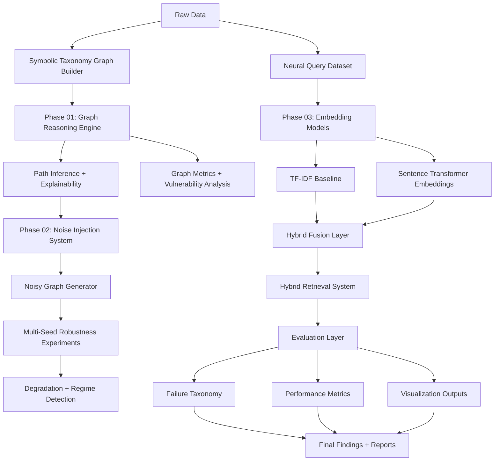

# Neuro-Symbolic Reasoning: Graph, Neural, and Hybrid Systems Analysis


---

## 📌 Overview

This repository presents a structured empirical investigation into **neuro-symbolic reasoning systems**, focusing on how symbolic graph reasoning, neural embeddings, and hybrid fusion models behave under structural and semantic constraints.

The system is designed to evaluate:

- Symbolic reasoning via taxonomy graphs  
- Robustness under structural perturbation  
- Neural semantic generalization  
- Hybrid neuro-symbolic integration  

---

## 🧠 Core Research Question

> How do symbolic structure and neural semantic similarity interact when reasoning over hierarchical knowledge under noise and distribution shift?

---

## 🧱 System Architecture



---

## 📊 Experimental Phases

### Phase 01 — Symbolic Graph Reasoning

| Component | Description |
|----------|-------------|
| Input | Taxonomy graph (is-a hierarchy) |
| Method | Path-based inference |
| Output | Multi-hop reasoning chains |
| Metrics | Path correctness, hop depth, node vulnerability |

---

### Phase 02 — Robustness Under Noise

| Component | Description |
|----------|-------------|
| Input | Clean symbolic graph |
| Perturbation | Edge removal + corruption |
| Evaluation | Multi-seed stability testing |
| Output | Regime classification |

#### Regimes Observed

| Regime | Behavior |
|--------|----------|
| Stable | High success, consistent hops |
| Degraded | Partial failure under noise |
| Collapsed | Reasoning breaks entirely |

---

### Phase 03 — Neural + Hybrid Retrieval

| Model | Description | Strength | Weakness |
|------|-------------|----------|----------|
| TF-IDF | Lexical baseline | Fast | No semantics |
| Sentence Transformers | Semantic embeddings | Generalization | Weak structure |
| Hybrid Model | Graph + embeddings fusion | Balanced | Hub bias |

---

## 📈 Key Results

### Retrieval Performance

| Model | Accuracy | Avg Similarity |
|------|----------|----------------|
| TF-IDF | ~0.10 | 0.00 |
| Embeddings | ~0.50 | ~0.60 |
| Hybrid | ~0.40 | ~0.94 |

---

### Robustness Summary

| Metric | Value |
|------|------|
| Avg Success Drop | ~5% |
| Collapse Seeds | 2 / 10 |
| Stable Seeds | 3 / 10 |
| Degraded Seeds | 5 / 10 |

---

## ⚠️ Key Findings

### 1. Symbolic systems are structurally precise but fragile
Small perturbations cause catastrophic reasoning failure.

### 2. Neural models generalize but ignore structure
Semantic similarity does not guarantee ontological correctness.

### 3. Hybrid systems introduce new failure modes
- hub bias (over-reliance on central nodes like “animal”)  
- shortcut hallucinations  
- inconsistent path alignment  

---

## 🧪 Failure Taxonomy

| Type | Description |
|------|-------------|
| Lexical failure | TF-IDF mismatch |
| Semantic drift | embedding confusion |
| Structural collapse | graph disconnection |
| Hub over-reliance | hybrid shortcut bias |

---

## 📁 Repository Structure

```
analysis/        → experimental logic (Phase 01–02)
symbolic/        → graph reasoning engine
phase_03/        → embeddings + hybrid models
data/            → raw + processed datasets
results/         → all outputs (CSV, plots)
findings/        → research interpretation
tests/           → validation scripts
docs/            → design documentation
```

---

## 🚀 How to Run

### Install dependencies
```bash
pip install -r requirements.txt
```

---

### Phase 01
```bash
python -m analysis.phase_01_graph_analysis
```

---

### Phase 02
```bash
python -m analysis.phase_02_robustness_report_v1
```

---

### Phase 03 (Semantic)
```bash
python -m phase_03.embeddings.semantic_embedding_generator_v1
```

---

### Phase 03 (Hybrid)
```bash
python -m phase_03.experiments.phase_03_hybrid_retrieval_v1
```

---

## Outputs

All generated artifacts are stored in:

```
results/
```

Includes:

- retrieval CSVs
- robustness experiments
- failure breakdowns
- plots and visualizations

---

## Future Work

- Learned alignment between graph + embedding spaces  
- Adaptive hybrid weighting mechanisms  
- Ontology-aware embedding models  
- Neural-symbolic reasoning with constraints  
- Graph-aware transformer architectures  

---

## Interpretation

This project demonstrates a core limitation in current AI systems:

> Semantic similarity and symbolic correctness are fundamentally misaligned unless explicitly constrained.

---

## 👤 Author Note

This is a research prototype exploring neuro-symbolic reasoning under structural perturbation and semantic ambiguity.

